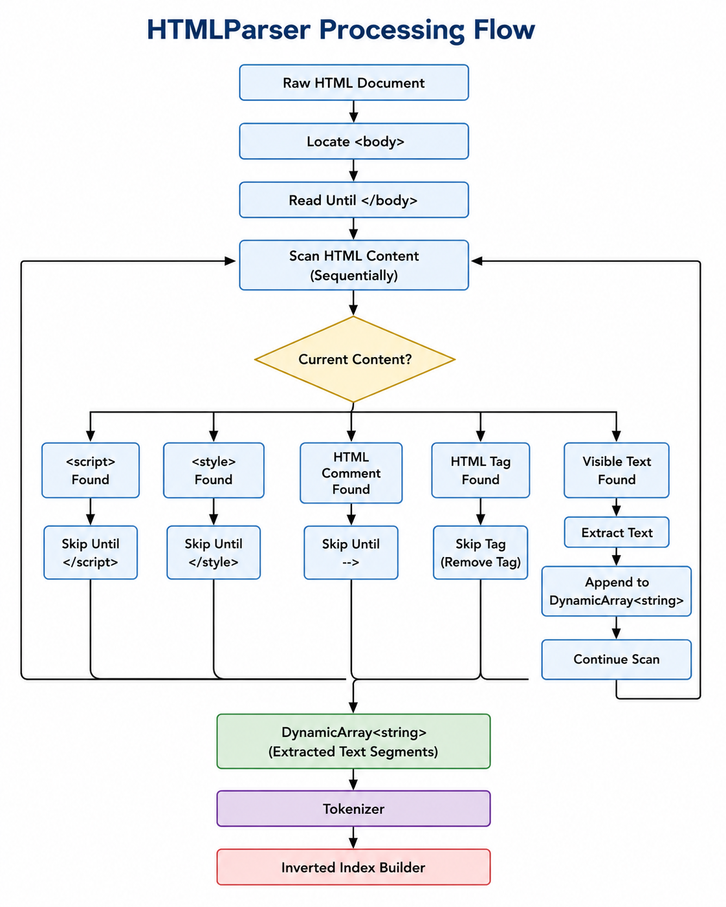

# HTMLParser Design Proposal
---

# Overview

The **HTMLParser** component is responsible for extracting visible textual content from raw HTML pages received from the crawler.

It converts HTML documents into clean text segments that can be processed by the **Tokenizer** component of the Indexer pipeline.

The HTMLParser only handles HTML structure. It does not perform word processing or indexing operations.

## Responsibilities

The HTMLParser is responsible for:

- Locating and reading content inside the `<body>` section.
- Extracting visible text from HTML documents.
- Removing HTML tags and attributes.
- Ignoring non-visible content such as scripts, styles, and comments.
- Preserving text boundaries between HTML elements.

## Non-Responsibilities

The HTMLParser does not handle:

- Tokenization.
- Lowercase conversion.
- Punctuation removal.
- Stop-word removal.
- Stemming.
- Inverted index construction.

---

# Section 1 – Public API

## Public Interface

```cpp
class HTMLParser
{
public:

    DynamicArray<string> extractText(
        const string& html);
};
````

## Method Description

| Method          | Parameters           | Return Type            | Description                                                                   |
| --------------- | -------------------- | ---------------------- | ----------------------------------------------------------------------------- |
| `extractText()` | `const string& html` | `DynamicArray<string>` | Extracts visible text from the HTML document and returns it as text segments. |

## Why this API?

The HTMLParser exposes only one public method because its responsibility is limited to HTML content extraction.

Keeping parsing separate from tokenization and indexing makes the component modular and easier to maintain.

---

# Section 2 – Internal Representation

The HTMLParser processes the HTML document sequentially.

It does not maintain permanent data structures. Extracted content is stored in a `DynamicArray<string>`.

## Processing Flow



## Extract

The parser extracts text from visible HTML content such as:

* Headings (`h1-h6`)
* Paragraphs (`p`)
* Divs (`div`)
* Spans (`span`)
* Anchor text (`a`)
* Lists (`li`)
* Tables (`td`, `th`)
* Other visible text inside `<body>`

Example:

Input:

```html
<h1>Search Engine</h1>
<p>Building Crawler</p>
```

Output:

```text
Search Engine
Building Crawler
```

---

## Ignore

The parser ignores:

* HTML tags
* Tag attributes (`href`, `class`, `id`, etc.)
* `<script>` content
* `<style>` content
* HTML comments
* `<head>` section
* Metadata tags

Example:

```html
<a href="google.com">
Google
</a>
```

Output:

```text
Google
```

---

# Section 3 – Failure Handling

| Situation                    | Handling Strategy                                  |
| ---------------------------- | -------------------------------------------------- |
| Empty HTML document          | Return empty `DynamicArray<string>`.               |
| Missing `<body>` tag         | Return empty `DynamicArray<string>`.               |
| Empty body content           | Return empty `DynamicArray<string>`.               |
| Malformed HTML               | Extract available readable text whenever possible. |
| Only ignored content present | Return empty `DynamicArray<string>`.               |

The parser should not stop indexing because of invalid HTML.

---

# Section 4 – Complexity Analysis

Let **n** be the size of the HTML document.

| Operation         | Complexity |
| ----------------- | ---------- |
| Locate `<body>`   | O(n)       |
| Scan HTML content | O(n)       |
| Extract text      | O(n)       |
| Overall Parsing   | O(n)       |

The parser processes the HTML document sequentially, so the overall time complexity is:

```text
O(n)
```

The output storage requires:

```text
O(m)
```

where **m** is the size of extracted text.

---

# Section 5 – Future Compatibility

The HTMLParser is the first stage of the Indexer pipeline.

```text
Crawler PageStorage

        |
        ▼

     Raw HTML

        |
        ▼

    HTMLParser

        |
        ▼

DynamicArray<string>

        |
        ▼

    Tokenizer

        |
        ▼

 Inverted Index
```

The component can be extended in the future with:

* Better malformed HTML handling.
* HTML entity decoding.
* Improved text extraction rules.
* Unicode support.

The public API remains unchanged while internal parsing logic can evolve independently.

